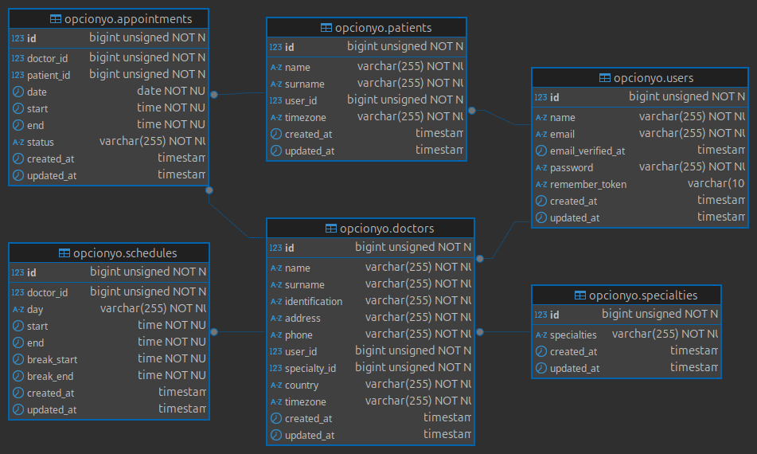

# Entorno de desarrollo

> [!NOTE]
> Se recomienda usar Docker para las pruebas


El proyecto cuenta con el _dockerfile_ y el _docker-compose_
para crean los contenedores.
La imagen se construye desde **php:8.3-fpm-alpine**

    PHP 8.3
    MySQL 8
    Nginx


# Setup Proyecto

### Composer
Utilizar el siguiente comando para instalar los paquetes necesarios

```
composer install
```

### Env
copiar el **.env.example** para tener los valores necesarios para el proyecto

```
cp  .env.example .env
```

### BD y Seeders
Para la creacion de la base de datos y los seeders ejecutar

```
php artisan migration:seed
```
### Google calendar

El proyecto usa Google calendar para almacenar los turnos en esa herramienta, para ello usa el paquete [spatie/laravel-google-calendar](https://github.com/spatie/laravel-google-calendar)

> [!TIP]
> Seguir las instrucciones de instalacion desde el repositorio del paquete utilizando OAuth2


# Rutas
> [!NOTE]
> Las rutas se pueden acceder desde **localhost:puerto/api/v1/**


#### Rutas GET y querys que recibe

##### appointments/avalaible #0969DA
```
date: Y-m-d
time: H:i
```

##### doctors/avalaible
```
date: Y-m-d
startTime: H:i
endTime: H:i
```

##### doctors/export
```
date: Y-m-d
```

# Extras
> [!TIP]
> Se incluye un [archivo](Insomnia-All_2025-03-28.json) con las consultas a la API para ser usado con la APP [Insomnia](https://insomnia.rest/download)

##### Diagrama de la BD

